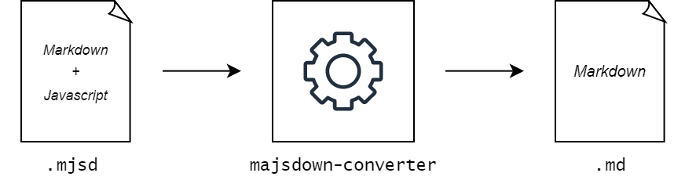

# Majsdown

> **The unholy union between Markdown and JavaScript.**

## In A Nutshell

Majsdown (work-in-progress, experimental) is yet another flavour of Markdown that allows JavaScript code to be embedded directly as part of a document. The JavaScript code is then executed by an interpreter that ends up creating a final Markdown document. Basically, it provides a way to preprocess Markdown documents using JavaScript.



Any existing Markdown (`.md`) document is a valid Majsdown (`.mjsd`) document. The easiest way to use Majsdown is to invoke the converter from the command-line:

```bash
./majsdown-converter.exe < ./src.mjsd > out.md
```

## Features

### Inline JavaScript Expressions

The `@@{<expression>}` syntax denotes an inline JavaScript expression that will be substitued in the final Markdown document with its evaluated result.

<table>
<tr>
<td>

```markdown
Hello world! I am @@{20 + 7} years old.
```

</td>
<td>

```markdown
Hello world! I am 27 years old.
```

</td>
</tr>
</table>

### Inline JavaScript Statements

The `@@$ <statement>` syntax denotes an inline JavaScript statement that will be executed during conversion.

<table>
<tr>
<td>

```markdown
@@$ var slideCount = 24;

This presentation contains @@{slideCount} slides.

@@$ slideCount = 25;

Actually, it contains @@{slideCount} slides -- sorry!
```

</td>
<td>

```markdown
This presentation contains 24 slides.

Actually, it contains 25 slides -- sorry!
```

</td>
</tr>
</table>

### Code Block JavaScript Decorators

The `@@_{<expression>}` denotes a code block JavaScript decorator that will execute the given `<expression>` making providing the following variables in its scope:

- `code`: string representing the contents of the code block.

- `lang`: string representing the language used in the code block.

It will then expand to the result of `<expression>`, similarly to an inline JavaScript expression.

This syntax can only be used with a triple-backtick code block.

<table>
<tr>
<td>

``````markdown
@@$ function wrapInCodeBlock(code, lang)
@@$ {
@@$     return "```" + lang + "\n" + code + "\n```";
@@$ }
@@$
@@$ function replaceStdNamespace(ns, code, lang)
@@$ {
@@$     return wrapInCodeBlock(
@@$         code.replace(/std::/g, `${ns}::`), lang
@@$     );
@@$ }

@@_{replaceStdNamespace("bsl", code, lang)}
```cpp
std::string greeting = "hello world";
std::cout << greeting << std::endl;
```

``````

</td>
<td>

``````markdown
```cpp
bsl::string greeting = "hello world";
bsl::cout << greeting << bsl::endl;
```
``````

</td>
</tr>
</table>

Possible use cases:

- Automatically generate a Compiler Explorer link for a code block, see [`examples/embed_godbolt`](./examples/embed_godbolt).


### Special Functions

Majsdown provides the following special JavaScript functions:

- `majsdown_include(<path>)`
  - Includes an existing JavaScript file, similarly to C/C++'s `#include` preprocessor directive. The contents of the file will be executed as part of the conversion process.

- `majsdown_embed(<path>)`
  - Includes an existing file as a string. Useful to include an external file (e.g. code snippet) as part of the Majsdown document without having to copy-paste.

## Internals

Majsdown depends on:

- [`vrm_pp`](https://github.com/vittorioromeo/vrm_pp): my own open-source preprocessor metaprogramming library.

- [`Discount`](https://github.com/Orc/discount): Markdown parsing library.

- [`quickjs`](https://github.com/vittorioromeo/quickjs): small embeddable JavaScript interpreter.

The `majsdown-converter` application is written in C++20.
